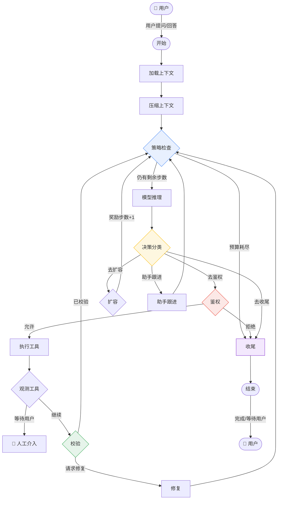

# MiniCode-plus

> 终端优先的 AI Coding Agent · Python 3.11+ · LangGraph 图运行时

MiniCode-plus 是一个轻量级终端编程助手：模型在图中循环「推理 → 鉴权 → 执行工具 → 观测 → 校验」，支持人机暂停恢复、模型故障自动切换、Skill 热榜按任务相关性注入。

## 快速开始

```bash
# 安装（可编辑模式 + 开发依赖）
pip install -e ".[dev]"

# 无 API Key 的 Mock 模式先跑通
MINI_CODE_MODEL_MODE=mock python -m minicode.main

# 一次性执行（CI/脚本）
echo "解释这段代码" | python -m minicode.headless
```

### 入口一览

| 命令 | 说明 |
| --- | --- |
| `minicode-py` | 交互式 TUI 会话（工具、权限、会话持久化） |
| `minicode-headless` | 非交互一次性执行，支持 `MINI_CODE_HEADLESS_MESSAGES_OUT` 追踪 |
| `minicode-readiness` | 供应商/运行时就绪门禁（`--json --fail-on blocked`） |
| `minicode-structure-check` | AGENTS.md 结构合规扫描 |
| `minicode-provider-smoke` | 供应商连通冒烟 |

## 架构：LangGraph 单一拓扑（Slice 5 默认）

锚点：`minicode/graph/builder.py:build_model_graph` + `minicode/graph/runtime.py:run_graph_turn`。
所有回边收敛到 **策略检查** 节点，每步只跑一次预算/策略事件。



### Human-In-The-Loop

图内 `终止原因=等待用户` 时主动让出控制权；`SqliteSaver` 把 `AgentState` 落盘到
`~/.mini-code/langgraph-checkpoints.sqlite3`，同一 `thread_id` 重新 `graph.invoke` 即恢复。

### 模型故障兜底

`minicode/model_fallback.py: call_model_with_fallback` 独立封装：

1. 首次调用失败 → 按 provider 可用性特征判定是否值得切换；
2. 经 `ModelSwitcher` 切换到第一个可用 fallback 并发 `recovery` 事件；
3. 双双失败 → 返回带「上游渠道不可用」指引的类型化 blocked 文案，回合不崩溃。

## Skill 系统：热榜 Top20 注入

Skill 发现遵循四个根目录（同名时前者优先）：

| 优先级 | 根目录 | 来源标签 |
| --- | --- | --- |
| 1 | `.mini-code/skills/<name>/SKILL.md` | project |
| 2 | `~/.mini-code/skills/<name>/SKILL.md` | user |
| 3 | `.claude/skills/<name>/SKILL.md` | compat_project |
| 4 | `~/.claude/skills/<name>/SKILL.md` | compat_user |

在传统「全量发现 + `load_skill` 全文加载」之上，`minicode/skill_hotlist.py`
新增一条**使用反馈闭环**：

```text
load_skill(name) ─► _usage.json 计数（count / last_used / description）
        │ 每 5 次使用或距上次 >30min 自动触发
        ▼
curate_hotlist ─► _hotlist.md Top20（衰减分 score = count / (1 + days*0.2)，
                  新 Skill 7 天冷启动保底）
        │ 每轮 turn
        ▼
get_hot_skills_for_prompt(cwd, query=当前任务)
        └► BM25 二排（ASCII 词 + CJK 字分词；query 点名 skill 名额外 +5 强提升）
        ▼
system prompt 只注入重排后的 Top20，模型仍可 load_skill 任意冷门 Skill
```

管理命令：

```bash
python -m minicode.manage_cli skills list
python -m minicode.manage_cli skills add <path> [--name <name>] [--project]
python -m minicode.manage_cli skills remove <name> [--project]
```

会话内 `/skills` 仍列出全部发现结果。

## 配置

`~/.mini-code/settings.json`：

```json
{
  "model": "claude-sonnet-4-20250514",
  "env": {
    "ANTHROPIC_AUTH_TOKEN": "<your-token>"
  }
}
```

常用环境变量：

| 变量 | 说明 |
| --- | --- |
| `MINI_CODE_MODEL_MODE=mock` | 无 Key 跑通全流程 |
| `MINICODE_TOOL_TIMEOUT` | 单工具超时秒数（默认 120） |
| `MINICODE_GRAPH_CHECKPOINT=1` | 无 session 时也启用文件检查点 |
| `MINI_CODE_COMMAND_ENCODING` | Windows 命令输出编码 |
| `MINICODE_MEMORY_PIPELINE=0` | 关闭记忆管线（跳过 `MemoryPipeline.read/write`，仅保留 `MemoryManager` 基础上下文，适合大仓/低配 CI 降开销） |

## 工程结构

本仓库按 `AGENTS.md` 产品项目根 profile 组织：

- `Main/MinicodeFrontline` — 产品应用投影契约（Entry/Query/Dto，含镜像测试）
- `Package/EngineeringStructure` — 结构扫描与合规查询
- `minicode/` — 当前实现根（80 顶层模块 + tools/30 + tui/19）

合规自检：

```bash
python -m minicode.structure_check
# AGENTS structure compliance: passed
```

## 测试

```bash
python -m pytest tests/ -q
```

## Memory system

MiniCode-plus includes closed-loop, cross-session memory through the unified `MemoryPipeline` entry point (`minicode/memory_pipeline.py`). Four operations cover the lifecycle:

| Operation | When | Behavior |
| --- | --- | --- |
| `read` | Task start | Classify the domain, combine BM25 and vector RRF retrieval, then let the LLM select; route relational and temporal questions to the memory graph automatically |
| `inject` | Prompt assembly | Use PID feedback control to decide how much memory to inject and how strict the threshold should be, then append it to the system prompt |
| `write` | Task end | Distill the execution trace (decisions, lessons, and improvement points) with ReflectionEngine before persisting it |
| `maintain` | Periodic background work | Merge insights, detect stale memories, and archive duplicates with CuratorAgent |

### Storage model

Scope and tier are orthogonal:

- Scope: USER (`~/.mini-code/memory/`, shared across projects), PROJECT (`.mini-code-memory/`, shared with the repository), and LOCAL (`.mini-code-memory-local/`, local and not committed)
- Tier: WORKING → SHORT_TERM (<7 days) → LONG_TERM (<30 days, compressed) → ARCHIVAL (permanent summary)

Writes are atomic. Loading performs structural validation and self-healing for corrupted data, while remaining compatible with hand-written `MEMORY.md` files.

### Memory graph and superseded audit

Facts are stored as quadruples (subject, predicate, value, source, confidence, and validity window). When a new fact supersedes an old one, the old fact is marked rather than deleted: its `valid_to` timestamp and a `supersedes` audit edge preserve the history. Current queries see only valid facts; point-in-time queries replay the graph to recover what was believed at that time. Contradictions are marked `disputed`, allowing retrieval to express an explicit preference instead of silently choosing a side.

### Injection control loop

Injection volume is feedback-controlled rather than a static limit:

- At ≥75% context usage, switch to SUMMARY mode and reduce injection; at ≥90%, stop injecting
- Low retrieval quality reduces volume and raises the threshold; user corrections tighten it per occurrence as a memory-confidence signal
- Recent failures add STRONG-mode experience; repeated tasks can reuse memory directly

The stability score produced by `AdaptivePIDTuner` (Ziegler-Nichols, relay feedback, or gradient self-tuning) flows through `update_control_state()` into the injection decision as adaptive PID trim, so tuned gains affect every injection.

### Failure recovery

When a turn contains a tool error, the pipeline automatically retrieves similar historical failures and their solutions. The next turn receives these as Failure Recovery Notes without requiring an explicit caller trigger.

### Main-loop integration

Both the interactive CLI loop and the headless entry load context through the pipeline. Each turn is reflected and persisted automatically, and maintenance runs once every 10 writes.

> **Overhead kill-switch:** set `MINICODE_MEMORY_PIPELINE=0` (also accepts `false/off/no/disable`) to skip the pipeline entirely. `MemoryManager.get_relevant_context()` remains, but `MemoryPipeline.read/write/maintain/inject` become no-ops — useful for large repos or low-cost CI where the ~5-file wiring adds visible latency. Re-enable by unsetting or setting `=1`.

## Release verification

Focused release gates (see `Docs/Documentation/engineering/material-inventory.json`):

```bash
python -m minicode.release_readiness --check-fallback-evidence benchmarks/release_readiness_results.json
python -m minicode.release_readiness --check-release-report benchmarks/release_readiness_results.json
python -m minicode.release_readiness --check-release-markdown benchmarks/release_readiness_results.md --release-json benchmarks/release_readiness_results.json
```

## TODO

- [ ] 多 Agent 协调（基于现有 thread_id 检查点做父子图）
- [ ] 重写记忆系统
- [x] ~~重写 Skill 载入~~（已完成：热榜 Top20 + BM25 任务相关性二排）
