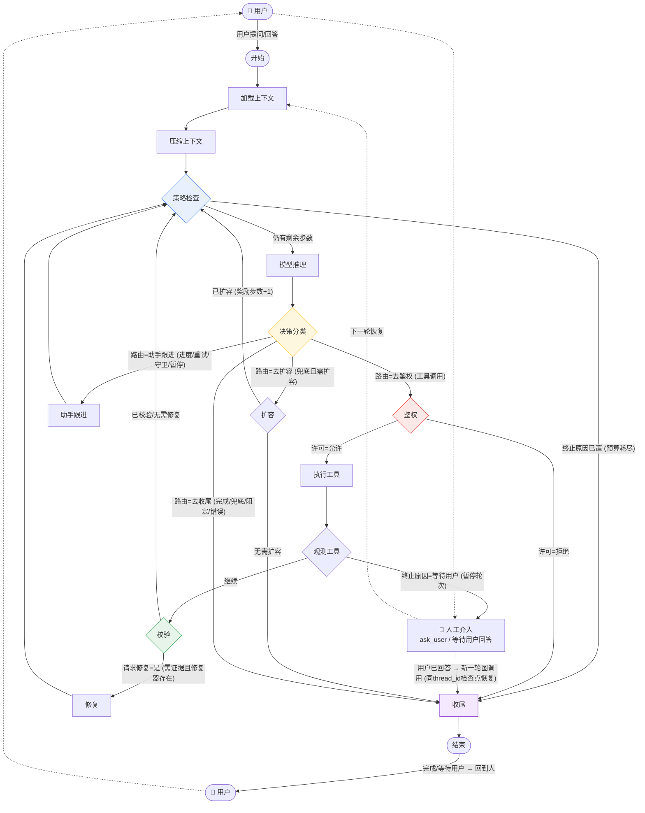
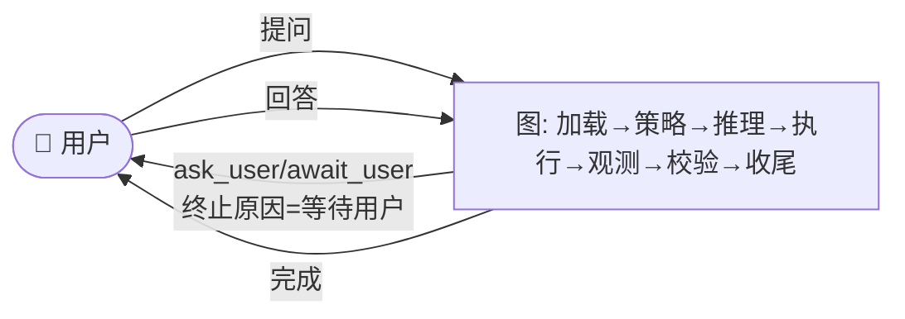

# MiniCode-plus

## LangGraph — Slice 1-5 (Slice 5 默认)

> `minicode/graph/builder.py:build_model_graph` + `minicode/graph/runtime.py:run_graph_turn` | 默认走图，`MINICODE_USE_GRAPH=0` / `runtime:{"useGraph":false}` 回退旧循环

所有回边收敛到 **策略检查**，Slice 5 新增 `store/on_thinking_delta` 透传、`ModelSwitcher` 兜底重试、回调对齐。

### Human-In-The-Loop

图内 `终止原因=等待用户` 主动让出控制权，`SqliteSaver` 保留 `AgentState`，同 `thread_id` 重新 `graph.invoke` 恢复。

## TODO

- [ ] 多 Agent 协调
- [ ] 重写记忆系统
- [ ] 重写 Skill 载入
