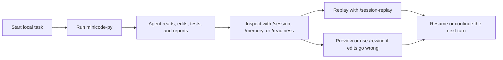
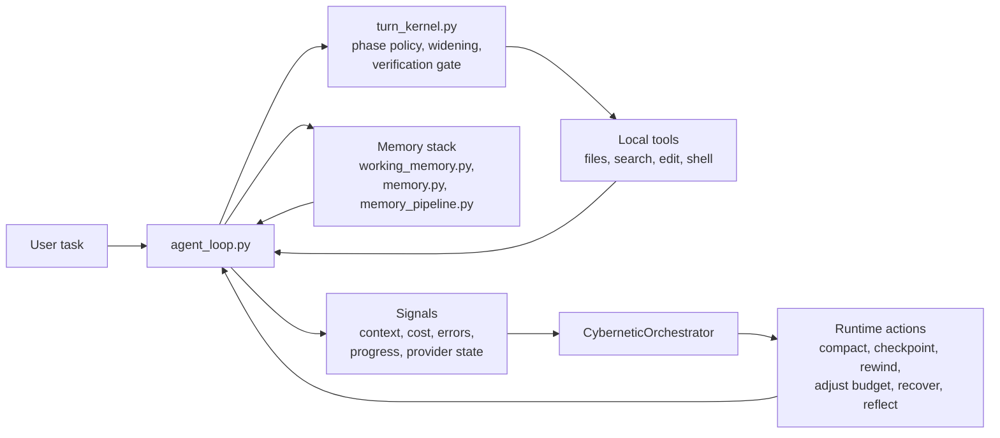

# MiniCode Python

<p align="center">
  <strong>A lightweight local coding agent for developers who want durable terminal workflows, not just a chat wrapper.</strong>
</p>

<p align="center">
  <a href="./README.zh-CN.md">Chinese</a>
  |
  <a href="https://github.com/LiuMengxuan04/MiniCode">MiniCode Main Repo</a>
  |
  <a href="https://github.com/QUSETIONS/MiniCode-Python">Python Repo</a>
</p>

<p align="center">
  
  
  
</p>

<p align="center">
  
</p>

<p align="center">
  <em>Real MiniCode frontend demo, not a mock: the landing page now reflects the current Python runtime and shows memory, session, rewind, and readiness as first-class product surfaces.</em>
</p>

MiniCode Python is the Python runtime in the MiniCode family. It is built for local development where the agent needs to survive long sessions, keep its state inspectable, recover from bad edits, and show what it is doing while it works.

If Claude Code represents the polished terminal-agent experience, MiniCode Python is the lightweight, local-first version that leans harder into runtime transparency, durable sessions, memory-backed continuity, rewindability, and verifiable behavior.

The screenshot above is rendered from the real MiniCode frontend demo. It highlights the four product promises we care about most on day one: memory that keeps context alive, sessions you can inspect and replay, rewind flows that make local edits safer, and readiness checks that tell you whether the runtime is actually ready to work.

## At a Glance

MiniCode Python is for you if you want:

- a terminal coding agent that behaves like a runtime, not a chat window;
- durable sessions you can inspect, replay, resume, and summarize;
- a memory stack that can protect working context and re-inject relevant project knowledge;
- safe local editing with checkpoints, rewind preview, and recovery flows;
- explicit signals for verification, widening, provider readiness, and failures.

If you only remember one thing, remember this:

> MiniCode Python is optimized for local trust: you should be able to inspect the work, recover the edits, and understand why the agent stopped.

## Why This Repo Exists

Most coding-agent READMEs lead with model access and feature lists. MiniCode Python is organized around a different promise:

> the runtime should be observable, recoverable, and testable, not just clever.

That changes the product priorities:

| Priority | What it means here |
| --- | --- |
| Session-first | Sessions can be inspected, replayed, resumed, and summarized. |
| Recovery-first | File edits are checkpointed, previewable, and rewindable. |
| Runtime-first | Widening, verification, compaction, and stop reasons are explicit. |
| Local-first | The agent is built around real repos, local tools, and terminal workflows. |

## Why MiniCode Python

| Area | What MiniCode Python emphasizes |
| --- | --- |
| Durable sessions | Inspect, replay, resume, and summarize live or saved sessions with local commands. |
| Memory as a first-class system | Protect active task context, re-inject project knowledge, compact with memory awareness, and persist useful reflections over time. |
| Safe recovery | Automatic checkpoints, rewind preview, rewind safety groups, and saved-session rewind flows. |
| Runtime control | `single` and `single-deep` profiles, phase-aware execution, widening, verification gates, and structured stop reasons. |
| Observable behavior | Runtime timelines, readiness reports, provider diagnostics, transcript summaries, and benchmark artifacts. |
| Local product surface | CLI and TUI commands such as `/session`, `/session-replay`, `/memory`, `/checkpoints`, `/rewind`, and `/readiness`. |
| Verifiable implementation | The root package is backed by an active test suite, not aspirational docs. |

## What You Can Do Today

With the current repository state, you can already:

- run an interactive terminal agent with `minicode-py`;
- run a single-shot command with `minicode-headless`;
- run a provider/runtime readiness gate with `minicode-readiness`;
- inspect the current session with `/session`;
- browse previous sessions with `/sessions`;
- replay a session with `/session-replay`;
- inspect memory state with `/memory`;
- inspect checkpoints with `/checkpoints`;
- preview or execute rewinds with `/rewind-preview` and `/rewind`;
- inspect provider and fallback health with `/readiness`.

## 3-Minute Demo

### 0. What you need

- Python 3.11+
- a local terminal on Windows, macOS, or Linux
- model/provider credentials if you want live model execution

### 1. Install and launch

```bash
git clone https://github.com/QUSETIONS/MiniCode-Python.git
cd MiniCode-Python
python -m pip install -e .[dev]
minicode-py
```

### 2. Ask it to do a real repo task

```text
Explain this repository and tell me which commands matter most for day-to-day use.
```

You should expect the normal MiniCode loop here: inspect repo state, explain findings, then let you inspect, replay, or continue the session.

### 3. Inspect what the runtime is doing

```text
/session
/memory
/readiness
```

### 4. Replay or recover if needed

```text
/session-replay
/checkpoints
/rewind-preview
```

### 5. Run one-shot headless mode

```bash
minicode-headless "Explain what this repo does."
```

### 6. Run a readiness gate

```bash
minicode-readiness --json --fail-on blocked
minicode-readiness --examples-out .temp/readiness-fallback-examples.json --fail-on blocked
minicode-readiness --doctor-out .temp/readiness-doctor.md --fail-on blocked
minicode-readiness --repair-plan-out .temp/readiness-repair-plan.json --fail-on blocked
minicode-readiness --patch-preview-out .temp/readiness-fallback-patch-preview.json --fail-on blocked
minicode-readiness --bundle-out .temp/readiness-bundle --fail-on blocked
python -m minicode.release_readiness --check-readiness-bundle .temp/readiness-bundle
python -m minicode.release_readiness --write-artifact-manifest .temp/readiness-artifact-manifest.json --artifact fallback_examples_json=.temp/readiness-fallback-examples.json --artifact doctor_markdown=.temp/readiness-doctor.md --artifact repair_plan_json=.temp/readiness-repair-plan.json --artifact patch_preview_json=.temp/readiness-fallback-patch-preview.json
python -m minicode.release_readiness --check-artifact-manifest .temp/readiness-artifact-manifest.json
python -m minicode.release_readiness --check-fallback-patch-preview .temp/readiness-fallback-patch-preview.json
python -m minicode.release_readiness --check-fallback-simulation .temp/readiness-bundle/readiness-fallback-simulations.json
python -m minicode.release_readiness --check-fallback-switch-smoke
python benchmarks/release_readiness.py
minicode-provider-smoke --help
python -m minicode.release_readiness --check-fallback-evidence benchmarks/release_readiness_results.json
python -m minicode.release_readiness --check-release-report benchmarks/release_readiness_results.json
python -m minicode.release_readiness --check-release-markdown benchmarks/release_readiness_results.md --release-json benchmarks/release_readiness_results.json
```

Use `--fail-on blocked` for CI environments where provider warnings should be
reported but not fail local product gates. Use `--fail-on warning` when a release
candidate must have a ready provider and at least one ready fallback. The
`--examples-out` artifact is read-only guidance; it never writes credentials or
changes your MiniCode settings. The `--doctor-out` artifact adds a human-readable
readiness repair report for CI and release bundles, including a local preflight
checklist for primary provider config, fallback coverage, configured/default
fallbacks, and the still-separate live provider smoke. The `--repair-plan-out`
artifact exports the same next steps as structured, redacted JSON so CI can keep
the repair path auditable without writing credentials. The `--patch-preview-out`
artifact exports redacted settings merge patch previews so the chosen fallback
provider can be reviewed before any local settings change. The artifact manifest
command records existence, size, and SHA-256 for readiness artifacts so CI can
detect missing or drifting evidence. `--bundle-out` writes examples, doctor,
repair plan, patch preview, offline fallback simulations, and manifest together
for the lowest-friction local check.
`--check-fallback-patch-preview` validates patch preview safety fields, apply
notes, merge patch shape, and redaction. `--check-readiness-bundle` validates
that bundle as one unit, including schema, manifest, and redaction.
`--check-fallback-simulation` validates every offline fallback simulation and
rejects any live-provider claim; it does not call a provider.
`benchmarks/release_readiness.py` is an offline report-only gate; use
`minicode-provider-smoke` separately when a release candidate needs a real
provider request. The benchmark still validates the generated headless trace
so offline/provider-configuration failures keep a machine-readable readiness
snapshot and repair plan. `--check-release-report` validates the full
release JSON schema and evidence links while still allowing provider `at-risk`
when the diagnostic evidence is present. `--check-release-markdown` validates
that the human-readable report contains the same status, smoke, provider,
fallback, and artifact evidence as the release JSON. `--check-fallback-evidence` validates
that provider risk is paired with fallback coverage or an auditable fallback
repair path. Use `--fail-on at-risk` on the offline report when local release
policy should reject any unresolved provider risk.

The ordinary readiness APIs are local-only, and release benchmark child checks
run with an isolated HOME, so credentials in the current shell or
`~/.mini-code` cannot silently trigger a provider request there. For one
bounded real-provider check, use both explicit gates:

```bash
MINICODE_LIVE_PROVIDER_SMOKE=1 minicode-provider-smoke --run-live --timeout 45
```

The command emits only redacted structured evidence and returns a non-zero
status for blocked configuration, provider failure, or timeout. The runtime
profile benchmark has the same two-gate behavior with
`--live-provider-smoke` when live diagnostics are needed.

## Typical Workflow



The main point is simple: MiniCode Python is not trying to hide the runtime. It lets you see the work, inspect the state, and recover from mistakes without manually cleaning everything up.

That same philosophy applies to memory: active task context is protected, durable project knowledge can be re-injected when it matters, and compaction is allowed to reuse memory instead of blindly dropping context.

## Everyday Commands

If you only use six commands at first, use these: `/session`, `/sessions`, `/session-replay`, `/memory`, `/rewind-preview`, and `/readiness`.

| Command | What it does |
| --- | --- |
| `/session` | Show the current live session snapshot. |
| `/sessions` | List saved sessions for the current workspace. |
| `/session-replay` | Replay the current or a saved session with transcript and runtime context. |
| `/memory` | Show memory system status for the current workspace. |
| `/checkpoints` | Show checkpoint history for the current or a saved session. |
| `/rewind-preview` | Preview what a rewind would restore before changing files. |
| `/rewind` | Rewind the latest edit group, a step count, or a checkpoint id. |
| `/readiness` | Inspect runtime/provider readiness, fallback coverage, and product surface status. |

## Current Status

This repository is past the prototype stage. It already behaves like a usable local product, but it is still being tightened into a more polished lightweight Claude Code style experience.

The active package is the root `minicode/` package configured by `pyproject.toml` as `minicode-py`.

Current cross-platform CI verification result:

```text
1311 passed, 2 skipped
```

Verification command:

```bash
python -m compileall -q minicode tests benchmarks Main Package
python -m minicode.structure_check --root . --hotspots 5 --max-dependency-upstream 4 --check-material-inventory --report .temp/structure-compliance.json
python -m minicode.release_readiness --check-structure-compliance-artifact .temp/structure-compliance.json
python -m minicode.readiness --json --fail-on blocked
python -m minicode.readiness --examples-out .temp/readiness-fallback-examples.json --fail-on blocked
python -m minicode.readiness --doctor-out .temp/readiness-doctor.md --fail-on blocked
python -m minicode.readiness --repair-plan-out .temp/readiness-repair-plan.json --fail-on blocked
python -m minicode.readiness --patch-preview-out .temp/readiness-fallback-patch-preview.json --fail-on blocked
python -m minicode.readiness --bundle-out .temp/readiness-bundle --fail-on blocked
python -m minicode.release_readiness --check-readiness-bundle .temp/readiness-bundle
python -m minicode.release_readiness --write-artifact-manifest .temp/readiness-artifact-manifest.json --artifact fallback_examples_json=.temp/readiness-fallback-examples.json --artifact doctor_markdown=.temp/readiness-doctor.md --artifact repair_plan_json=.temp/readiness-repair-plan.json --artifact patch_preview_json=.temp/readiness-fallback-patch-preview.json
python -m minicode.release_readiness --check-artifact-manifest .temp/readiness-artifact-manifest.json
python -m minicode.release_readiness --check-fallback-patch-preview .temp/readiness-fallback-patch-preview.json
python -m minicode.release_readiness --check-fallback-simulation .temp/readiness-bundle/readiness-fallback-simulations.json
python -m minicode.release_readiness --check-fallback-switch-smoke
python benchmarks/release_readiness.py
python -m minicode.release_readiness --check-fallback-evidence benchmarks/release_readiness_results.json
python -m minicode.release_readiness --check-release-report benchmarks/release_readiness_results.json
python -m minicode.release_readiness --check-release-markdown benchmarks/release_readiness_results.md --release-json benchmarks/release_readiness_results.json
python -m pytest -q --import-mode=importlib
```

Current state, honestly:

- core runtime, session, replay, checkpoint, rewind, readiness, and structure-compliance surfaces are in good shape;
- memory is not bolted on: working memory, project memory, memory injection, and memory-aware compaction are already in the runtime path;
- provider and fallback diagnostics include local preflight checks, structured live-smoke failure context, and a validated headless trace artifact;
- real provider availability still depends on your local credentials and configured channels;
- the project is usable today, but it is still evolving toward a more polished lightweight Claude Code experience.

Live provider readiness still depends on configured credentials and channel
availability, so the default CI readiness gate only fails when the runtime is
blocked.

## Architecture



What matters is not the diagram itself. What matters is that runtime state is treated as something explicit:

- the loop can widen instead of silently stalling;
- verification can block a premature "done";
- memory can preserve task-critical context and re-inject project knowledge instead of relying only on the current chat window;
- session state can survive process boundaries;
- rewind can reverse local edits instead of asking you to clean them up by hand;
- readiness can tell you whether failure is local logic or provider availability.

## Repository Guide

| Path | Role |
| --- | --- |
| `minicode/` | Canonical Python package used by install and tests. |
| `tests/` | Active test suite. |
| `benchmarks/` | Runtime profile and release-readiness runners plus generated reports. |
| `Docs/Documentation/` | Architecture notes, optimization history, and productization reports. |
| `openspec/` | Specs, archived change records, and build/verify planning artifacts. |
| `.mini-code-memory/` | Workspace-level durable memory state created by the runtime. |

## Core Modules

| Module | Purpose |
| --- | --- |
| `minicode/agent_loop.py` | Main model and tool loop, runtime event flow, and product integration. |
| `minicode/turn_kernel.py` | Step policy, phase transitions, widening, and verification gates. |
| `minicode/session.py` | Durable sessions, inspect and replay views, checkpoints, and rewind helpers. |
| `minicode/cli_commands.py` | Local product commands such as session, replay, rewind, and readiness. |
| `minicode/memory.py` | Long-term project memory manager and retrieval surface. |
| `minicode/working_memory.py` | Protected working-memory entries that survive compaction pressure. |
| `minicode/memory_pipeline.py` | Closed-loop memory retrieval, injection, reflection writeback, and optimization path. |
| `minicode/product_surfaces.py` | User-facing summaries for readiness, hooks, instructions, delegation, and extensions. |
| `minicode/readiness.py` | Standalone readiness CLI used by local checks and CI gates. |
| `minicode/release_readiness.py` | Release-oriented runtime smoke and provider-readiness checks. |
| `minicode/model_switcher.py` | Bounded fallback and failover selection. |
| `minicode/runtime_profiles.py` | Runtime profiles such as `single` and `single-deep`. |
| `minicode/cybernetic_orchestrator.py` | Runtime control lifecycle facade. |

## MiniCode Family

| Version | Repository | Focus |
| --- | --- | --- |
| TypeScript | [LiuMengxuan04/MiniCode](https://github.com/LiuMengxuan04/MiniCode) | Mainline terminal agent, TUI, MCP, skills, sessions, and context controls. |
| Python | [QUSETIONS/MiniCode-Python](https://github.com/QUSETIONS/MiniCode-Python) | Local-first Python runtime with stronger session, rewind, readiness, and observability surfaces. |
| Rust | [harkerhand/MiniCode-rs](https://github.com/harkerhand/MiniCode-rs/tree/master) | Systems-side implementation and experiments. |
| Java | [hobbescalvin414-tech/minicode4j](https://github.com/hobbescalvin414-tech/minicode4j/tree/feat/default-ts-ui) | Java implementation with a TypeScript-style UI direction. |

## Documentation

Start here if you want the deeper implementation and productization record:


- [Chinese README](./README.zh-CN.md)
- [Optimization Summary](./Docs/Documentation/OPTIMIZATION_SUMMARY.md)
- [Memory Theory](./Docs/Documentation/memory_theory.md)
- [Minicode-lite Productization Design](./Docs/Documentation/superpowers/specs/2026-06-05-minicode-lite-productization-design.md)
- [Minicode-lite Build Plan](./Docs/Documentation/superpowers/plans/2026-06-05-minicode-lite-productization-build.md)
- [Minicode-lite Verify Report](./Docs/Documentation/superpowers/reports/2026-06-05-minicode-lite-productization-verify.md)
- [Main MiniCode Repository](https://github.com/LiuMengxuan04/MiniCode)

## Design Principles

- Keep the runtime inspectable.
- Treat memory as a controllable runtime subsystem, not an afterthought.
- Prefer measured signals over prompt folklore.
- Make recovery a product feature, not a manual cleanup step.
- Treat verification as part of execution, not just reporting.
- Keep docs aligned with implemented behavior, not future ambition.
