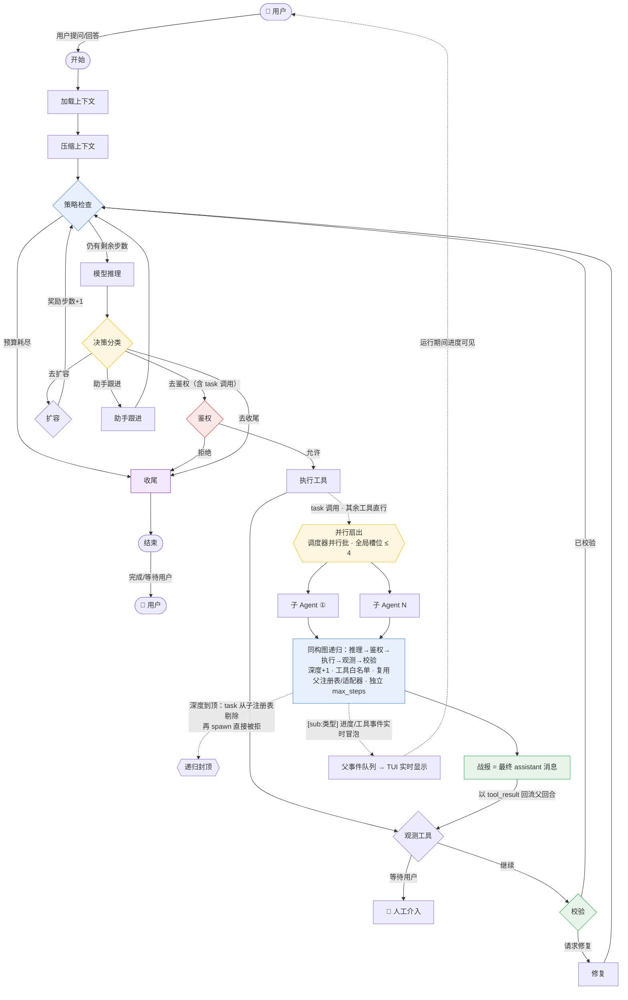
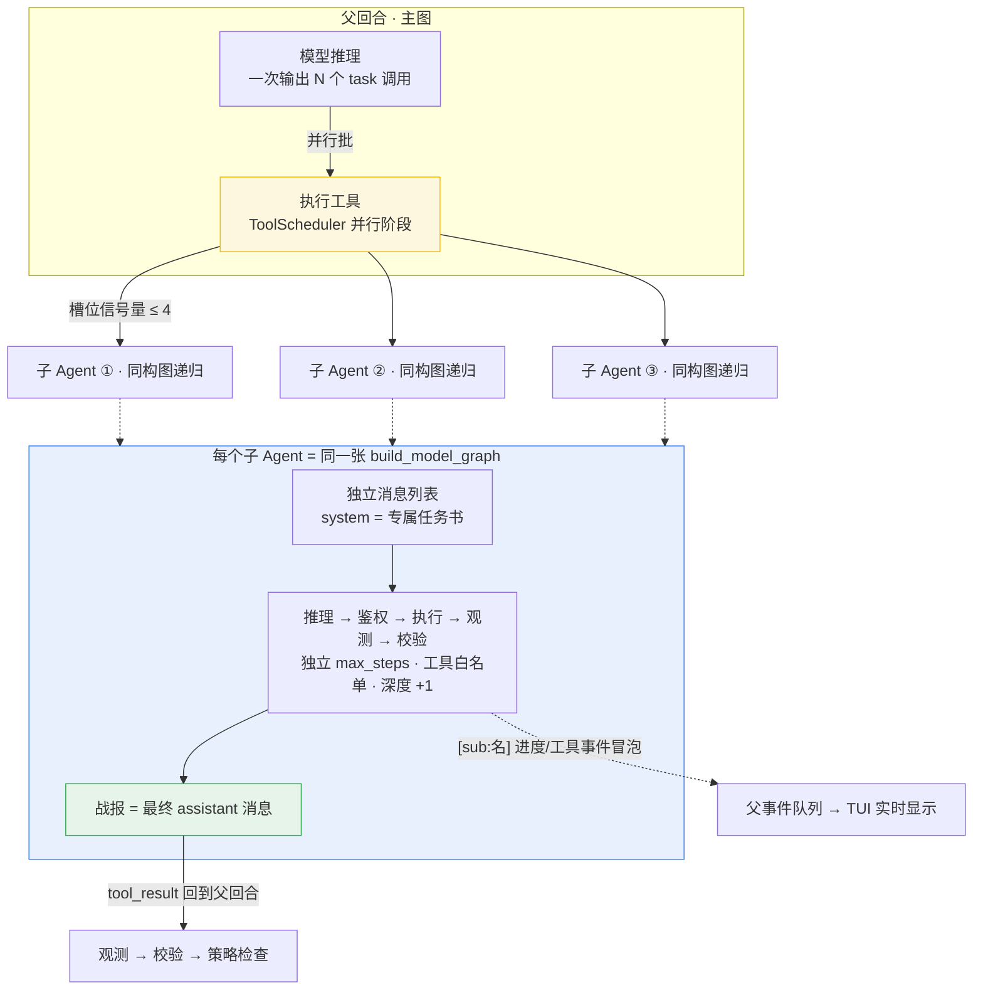

# MiniCode-plus

> 终端优先的 AI Coding Agent · Python 3.11+ · LangGraph 图运行时

MiniCode-plus 是一个轻量级终端编程助手：模型在 LangGraph 图中循环「推理 → 鉴权 → 执行工具 → 观测 → 校验」，
支持人机暂停恢复、模型故障自动切换、Skill 热榜按任务相关性注入、闭环控制式跨会话记忆，
并可通过 `task` 工具把子任务扇出给**并行子 Agent**（同构图递归、深度封顶、进度实时冒泡）。

> 🙏 本项目基于 [LiuMengxuan04/MiniCode](https://github.com/LiuMengxuan04/MiniCode) 演进，感谢原项目打下的基础。

## ✨ 核心特性

| 特性 | 一句话说明 |
| --- | --- |
| [**LangGraph 单一拓扑**](#-架构总览langgraph-单一拓扑) | 一张图跑通完整 agent 循环：所有回边收敛到策略检查节点；人机协同可暂停恢复、模型故障自动切换 |
| [**多 Agent 编排**](#-多-agent-编排task-工具) | `task` 工具即子 Agent：并行扇出、同构图递归、深度封顶、槽位上限、事件实时冒泡到 TUI |
| [**Skill 热榜加载**](#-skill-热榜加载) | 使用反馈闭环 + 衰减分 Top20 + BM25 任务相关性二排，system prompt 只注入最相关的 Skill |
| [**记忆系统**](#-记忆系统) | 四动词闭环（read/inject/write/maintain）+ PID 注入控制 + 记忆图谱 superseded 审计 |

外加：Reasoning 模型思考流（`∴ Thinking…` 实时增长）、`.env` 零依赖自动加载、AGENTS.md 结构合规门禁。

## 🚀 快速开始

```bash
# 安装（可编辑模式 + 开发依赖）
pip install -e ".[dev]"

# 无 API Key 的 Mock 模式先跑通
MINI_CODE_MODEL_MODE=mock python -m minicode.main

# 一次性执行（CI/脚本）
echo "解释这段代码" | python -m minicode.headless
```

接入真实模型：项目根放 `.env`（自动加载，只补缺失的环境变量，不覆盖已 export 的值）：

```dotenv
CUSTOM_API_KEY=sk-...
CUSTOM_API_BASE_URL=https://your-openai-compatible-endpoint/v1
ANTHROPIC_MODEL=your-model
```

启动交互式 TUI：

```bash
minicode-py
```

### 入口一览

| 命令 | 说明 |
| --- | --- |
| `minicode-py` | 交互式 TUI 会话（工具、权限、会话持久化、思考流显示） |
| `minicode-headless` | 非交互一次性执行，支持 `MINI_CODE_HEADLESS_MESSAGES_OUT` 追踪 |
| `minicode-readiness` | 供应商/运行时就绪门禁（`--json --fail-on blocked`） |
| `minicode-structure-check` | AGENTS.md 结构合规扫描 |
| `minicode-provider-smoke` | 供应商连通冒烟（`--run-live`，需 `MINICODE_LIVE_PROVIDER_SMOKE=1`） |

## 🧭 架构总览：LangGraph 单一拓扑

锚点：`minicode/graph/builder.py:build_model_graph` + `minicode/graph/runtime.py:run_graph_turn`。
所有回边收敛到**策略检查**节点，每步只跑一次预算/策略事件。这张图同时是父回合与所有子 Agent 的执行体。
图中**实线为主拓扑**；**虚线是 `task` 工具补入的多 Agent 逻辑**（详见下一章）：并行扇出 → 同构图递归 → 战报以 tool_result 回流观测节点，子 Agent 事件实时冒泡到 TUI。



### Human-In-The-Loop

图内 `终止原因=等待用户` 时主动让出控制权；`SqliteSaver` 把 `AgentState` 落盘到
`~/.mini-code/langgraph-checkpoints.sqlite3`，同一 `thread_id` 重新 `graph.invoke` 即恢复。

### 模型故障兜底

`minicode/model_fallback.py: call_model_with_fallback` 独立封装：

1. 首次调用失败 → 按 provider 可用性特征判定是否值得切换；
2. 经 `ModelSwitcher` 切换到第一个可用 fallback 并发 `recovery` 事件；
3. 双双失败 → 返回带「上游渠道不可用」指引的类型化 blocked 文案，回合不崩溃。

## 🤖 多 Agent 编排（task 工具）

### 设计决策：子 Agent 即工具，而不是编排节点

多 Agent 化有两条路线：给主图加「编排节点」（动图结构、加路由、加状态字段），或把**子 Agent 做成一个工具**（`task`），模型像调用 `read_file` 一样调用它。MiniCode-plus 选择后者：

- **主图零改动**：`task` 走现有「推理 → 鉴权 → 执行工具 → 观测」路径，权限、预算、校验、事件全部复用；
- **子 Agent 跑的就是同一张图**：`task` 内部递归调用 `run_graph_turn`（`minicode/graph/runtime.py`），用 `build_model_graph` 构建同构子图——每种子 Agent 类型只换 system prompt（任务书）与工具白名单；
- **委托决策留给模型**：何时扇出、拆成几个、怎么合并，由父模型自主决定；机制层只负责安全边界。

下图是上一章主拓扑图中 `task` 虚线分支的放大视图——扇出调度与子 Agent 内部结构：



### 三类子 Agent

| 类型 | 工具白名单 | 步数上限 | 定位 |
| --- | --- | --- | --- |
| `explore` | 只读（read/grep/list/tree/symbol） | 5 | 快速探索与检索 |
| `plan` | 只读 + code_review | 8 | 深度分析与方案 |
| `general` | 全量（继承父注册表，写操作仍走鉴权） | 15 | 多步实现任务 |

只读类型的子 Agent 拿到独立的 `PermissionManager`（无提示回调 → 写操作自动拒绝）；`general` 继承父的权限提示链。**子权限永远 ⊆ 父权限**。

### 五条机制不变式

实现落在 `minicode/tools/task.py`，全部有测试护栏（`tests/test_task_tool.py`）：

1. **深度封顶，递归在机制上不可能失控** —— runtime 携带 `subagentDepth` 计数；到达上限时 spawn 被拒绝，且 `task` 工具从子注册表中被剔除（孙 Agent 连尝试的入口都没有）。
2. **句柄复用，spawn 零重建** —— 父回合经 `tool_runtime` 注入 `toolRegistry` 与 `modelAdapter`（`minicode/graph/runtime.py`）；子 Agent 直接复用，不再重做 Skill 发现、MCP 连接和模型适配器构建，且 provider/mock 模式与父完全一致。
3. **并发扇出 + 全局槽位** —— `task` 标记 `CONCURRENCY_SAFE`，模型一批 N 个 task 调用自动进入 ToolScheduler 并行阶段；进程级信号量封顶同时在跑的子 Agent 数（默认 4）。
4. **事件冒泡，子 Agent 运行不静默** —— `_SubagentEventForwarder` 把子 Agent 的阶段进度、工具启动、工具失败加 `[sub:类型]` 前缀实时转发到父事件队列；思考流/流式块刻意不转发（避免与父流交错）。
5. **超时与检查点隔离** —— `task` 自声明 `timeout_seconds=600`（工具级声明优先于全局 `MINICODE_TOOL_TIMEOUT` 与调度器收紧）；子 runtime 剥离 `graphCheckpoint`，并行扇出不会争抢同一 sqlite 检查点文件。

### 使用示例

```text
你：同时派两个 explore 子 agent：一个分析 minicode/graph，一个分析 minicode/tools，汇总对比两者的组织方式。

TUI 实时显示：
  [sub:Explore] Runtime phase: explore. inspect, decompose...
  [sub:Explore] ▶ read_file
  [sub:Explore] ▶ grep_files
  （两个子 Agent 的进度流交错滚动，互不阻塞）
  [Sub-agent Explore completed] Turns: ... Duration: ...
  助手：两个目录的对比结论……（基于两份战报合并）
```

## 📚 Skill 热榜加载

Skill 发现遵循四个根目录（同名时前者优先）：

| 优先级 | 根目录 | 来源标签 |
| --- | --- | --- |
| 1 | `.mini-code/skills/<name>/SKILL.md` | project |
| 2 | `~/.mini-code/skills/<name>/SKILL.md` | user |
| 3 | `.claude/skills/<name>/SKILL.md` | compat_project |
| 4 | `~/.claude/skills/<name>/SKILL.md` | compat_user |

在传统「全量发现 + `load_skill` 全文加载」之上，`minicode/skill_hotlist.py` 新增一条**使用反馈闭环**：

```text
load_skill(name) ─► _usage.json 计数（count / last_used / description）
        │ 每 5 次使用或距上次 >30min 自动触发
        ▼
curate_hotlist ─► _hotlist.md Top20（衰减分 score = count / (1 + days*0.2)，
                  新 Skill 7 天冷启动保底）
        │ 每轮 turn
        ▼
get_hot_skills_for_prompt(cwd, query=当前任务)
        └► BM25 二排（ASCII 词 + CJK 字分词；query 点名 skill 名额外 +5 强提升）
        ▼
system prompt 只注入重排后的 Top20，模型仍可 load_skill 任意冷门 Skill
```

管理命令：

```bash
python -m minicode.manage_cli skills list
python -m minicode.manage_cli skills add <path> [--name <name>] [--project]
python -m minicode.manage_cli skills remove <name> [--project]
```

会话内 `/skills` 仍列出全部发现结果。

## 🧠 记忆系统

内置闭环控制式跨会话记忆，统一入口 `MemoryPipeline`（`minicode/memory_pipeline.py`），四个动词覆盖完整生命周期：

| 动词 | 时机 | 行为 |
| --- | --- | --- |
| `read` | 任务开始 | 领域分类 → BM25 → 向量 RRF 融合 → LLM 精选；关系型/时序问题自动路由记忆图谱 |
| `inject` | 提示词组装 | PID 反馈控制决定注多少、注多严，追加进 system prompt |
| `write` | 任务结束 | ReflectionEngine 蒸馏执行轨迹（决策/教训/改进点）后落盘 |
| `maintain` | 后台周期 | CuratorAgent 合并洞察、校验过时、归档重复 |

### 存储模型

Scope 与 Tier 双维度正交：

- Scope：USER（`~/.mini-code/memory/`，跨项目）/ PROJECT（`.mini-code-memory/`，随仓库共享）/ LOCAL（`.mini-code-memory-local/`，本地不入库）
- Tier：WORKING → SHORT_TERM（<7 天）→ LONG_TERM（<30 天，压缩）→ ARCHIVAL（永久摘要）

落盘走原子写入，加载带结构校验与损坏自愈，兼容手写 MEMORY.md。

### 记忆图谱与 superseded 审计

事实以四元组存储（subject-predicate-value + 出处 + 置信度 + 生效时间窗）。旧事实被新事实取代时**只标记不删除**：盖 valid_to 时间戳并建立 supersedes 审计边。当前查询只见有效事实；历史查询按时间点重放，可精确还原"当时相信什么"。矛盾事实标记 disputed，检索层可显式表达偏好而非静默选边。

### 注入控制闭环

注入量是反馈回路而非静态上限：

- 上下文占用 ≥75% 切 SUMMARY 档减量，≥90% 停注
- 检索质量低 → 减量提门槛；用户纠正 → 按次收紧（记忆可信度信号）
- 最近失败 → STRONG 档补经验；重复任务 → 允许直接复用

AdaptivePIDTuner（Ziegler-Nichols / 继电反馈 / 梯度自整定）产出的稳定性评分经 update_control_state() 直通注入决策（adaptive PID trim）——整定增益真实作用于每次注入。

### 失败恢复通道

回合轨迹包含工具错误时，自动检索相似历史失败与解法，下一轮以 Failure Recovery Notes 注入，无需调用方显式触发。CLI 交互循环与 headless 入口均经管线取上下文；每回合结束自动反思落盘，每 10 次 write 触发一次维护巡检。

> **开销兜底开关：** 设置 `MINICODE_MEMORY_PIPELINE=0`（亦接受 `false/off/no/disable`）即可跳过整条管线，仅保留 `MemoryManager.get_relevant_context()` 的基础上下文，适合大仓/低配 CI 降延迟。设为 `1` 或取消即恢复。

## 💭 Reasoning 模型支持（思考流）

OpenAI 兼容通道（`minicode/openai_adapter.py`）解析 DeepSeek R1 / vLLM 网关的 `reasoning_content`（及 OpenRouter 的 `reasoning`）字段：

- **流式**：每个 `delta.reasoning_content` 片段即时转发 `on_thinking_delta` —— 思考过程逐段实时到达，不是等响应结束；
- **非流式**：`message.reasoning_content` 整段一次性转发；
- 下游管道（runtime → TurnEventQueue → TUI）把它渲染为消息下方的 `∴ Thinking…` 实时增长条目；
- 回调异常被隔离，UI 故障不会杀掉模型步。

端到端实测（reasoning 模型，完整 agent 步）：207 个 thinking 事件、653 字符思考逐段流回，最终回答正常落盘。

## ⚙️ 配置参考

`~/.mini-code/settings.json`：

```json
{
  "model": "claude-sonnet-4-20250514",
  "env": {
    "ANTHROPIC_AUTH_TOKEN": "<your-token>"
  }
}
```

### 项目 .env（自动加载）

`minicode/config.py:_load_env_file` 在 `load_runtime_config` 时读取项目根 `.env`，只补缺失的进程环境变量（已 export 的值永不覆盖），无需 dotenv 依赖。支持注释、引号值、`export ` 前缀；重复键首个生效。测试进程默认 `MINICODE_DISABLE_ENV_FILE=1` 隔离开发者本地凭据（见 `conftest.py`）。

### 常用环境变量

| 变量 | 说明 |
| --- | --- |
| `MINI_CODE_MODEL_MODE=mock` | 无 Key 跑通全流程 |
| `CUSTOM_API_KEY` / `CUSTOM_API_BASE_URL` | OpenAI 兼容自定义端点 |
| `MINICODE_MODEL_TIMEOUT` | 单次模型推理超时秒数（默认 120；reasoning 模型建议 ≥ 240） |
| `MINICODE_TOOL_TIMEOUT` | 单工具超时秒数（默认 120；工具自声明 `timeout_seconds` 优先） |
| `MINICODE_SUBAGENT_MAX_DEPTH` | 子 Agent 世代深度上限（默认 1；`2` 允许孙 Agent） |
| `MINICODE_SUBAGENT_MAX_CONCURRENCY` | 并行子 Agent 槽位上限（默认 4） |
| `MINICODE_GRAPH_CHECKPOINT=1` | 无 session 时也启用文件检查点 |
| `MINI_CODE_COMMAND_ENCODING` | Windows 命令输出编码 |
| `MINICODE_DISABLE_ENV_FILE=1` | 禁用项目 .env 自动加载（测试默认开） |
| `MINICODE_MEMORY_PIPELINE=0` | 关闭记忆管线（见《记忆系统》） |

## 🧪 工程结构与测试

本仓库按 `AGENTS.md` 产品项目根 profile 组织：

- `Main/MinicodeFrontline` — 产品应用投影契约（Entry/Query/Dto，含镜像测试）
- `Package/EngineeringStructure` — 结构扫描与合规查询
- `minicode/` — 当前实现根（80 顶层模块 + tools/30 + tui/19）

```bash
# 结构合规门禁
python -m minicode.structure_check
# AGENTS structure compliance: passed

# 全量测试
python -m pytest tests/ -q
```

针对性套件：`tests/test_task_tool.py`（多 Agent 深度/复用/扇出/冒泡 13 例）、`tests/test_openai_adapter.py`（reasoning 解析）、`tests/test_input_parser.py`（括号粘贴回归）。

## 📦 Release verification

Focused release gates (see `Docs/Documentation/engineering/material-inventory.json`):

```bash
python -m minicode.release_readiness --check-fallback-evidence benchmarks/release_readiness_results.json
python -m minicode.release_readiness --check-release-report benchmarks/release_readiness_results.json
python -m minicode.release_readiness --check-release-markdown benchmarks/release_readiness_results.md --release-json benchmarks/release_readiness_results.json
```

## 🙏 致谢

- [LiuMengxuan04/MiniCode](https://github.com/LiuMengxuan04/MiniCode) —— 本项目的原项目，感谢其设计与实现基础。
