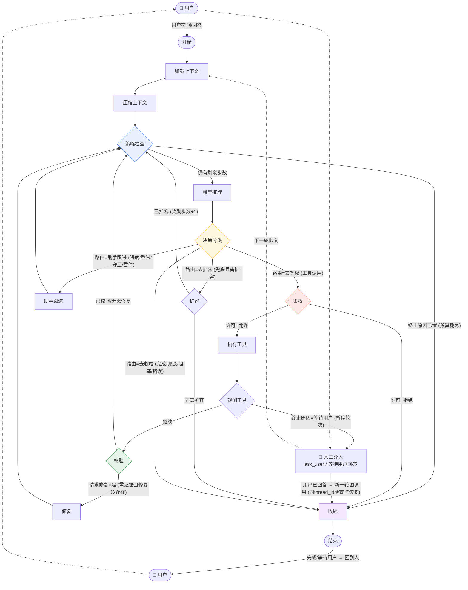
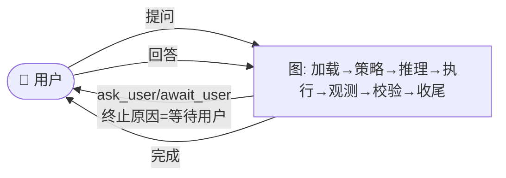
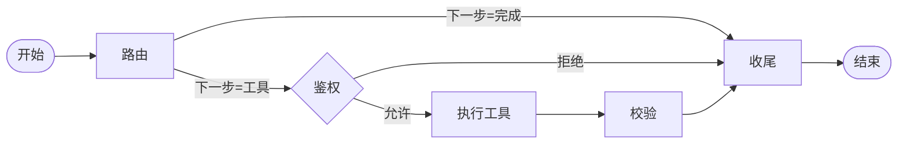
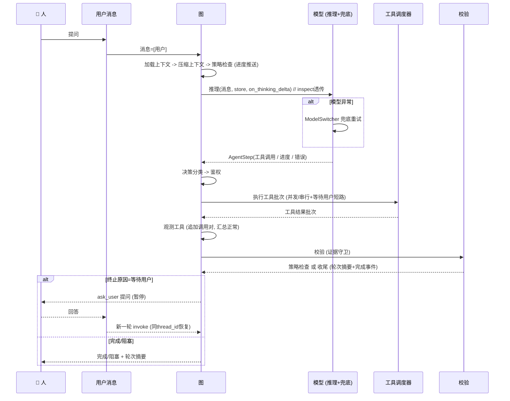

# MiniCode LangGraph 拓扑 — Slice 1-5 (main @ 41362e6)

> 生成时间: 2026-08-21 | 代码锚点: `minicode/graph/builder.py:build_model_graph` + `minicode/graph/runtime.py:run_graph_turn` + `minicode/agent_loop.py:shim`
> 默认路径已翻转：图为默认，仅 `MINICODE_USE_GRAPH=0` / `runtime:{"useGraph":false}` 回退旧循环

## 1. 单一拓扑 (Slice 5 / build_model_graph) — 当前默认

所有回边收敛到 **策略检查**（原 `while turn_state.has_remaining_steps()` 循环头），每步只跑一次预算/策略/阶段事件。Slice5 新增：`store/on_thinking_delta` 透传、`ModelSwitcher` 兜底重试、回调对齐。



### 条件路由表

| 源节点 | 路由函数 | 条件（中文） | 目标 |
|---|---|---|---|
| 策略检查 | `_loop_route` | 终止原因已置（步数耗尽） | 收尾 |
| | | 否则 | 模型推理 |
| 决策分类 | `_classify_route` | 路由 = 去鉴权 / 去扩容 / 助手跟进 / 去收尾 | 对应节点 |
| 鉴权 | `_permission_route` | 许可=允许 | 执行工具 |
| | | 许可=拒绝 | 收尾 |
| 观测工具 | `_observe_route` | 终止原因=等待用户 | 收尾 |
| | | 否则 | 校验 |
| 校验 | `_verify_kernel_route` | 请求修复=是 | 修复 |
| | | 否则 | 策略检查 |
| 扩容 | `_post_widen_route` | 终止原因已置 | 收尾 |
| | | 否则 | 策略检查 |

### 节点职责（Slice5 变更高亮）

| 节点（中文） | 原名 | 实现 | 关键状态读写 | Slice5 |
|---|---|---|---|---|
| 加载上下文 | `load_context` | 注入记忆上下文 | 消息列表, 记忆上下文 | - |
| 压缩上下文 | `compact` | 按需压缩/截断 | 已压缩, 消息列表 | - |
| 策略检查 | `step_policy` | 快照转状态→推导策略→渲染提示→进度推送 | 步数, 最大步数, 扩容阈值, 模型档位, 终止原因 | 进度推送对齐旧 `emit_progress` |
| 模型推理 | `model` | `next_step(状态)->AgentStep` | 本步调用列表, 决策信息 | **透传 `store/on_thinking_delta/on_stream_chunk`；捕获连接/超时/通用异常后走 `ModelSwitcher` 1次兜底重试，失败才 `类型=错误` + 兜底指引** |
| 决策分类 | `classify_step` | `decide_assistant_turn / decide_tool_turn` 复用内核决策 | 决策路由, 决策类型 | - |
| 鉴权 | `authorize` | 鉴权函数或 `PermissionManager` 自动构建 | 许可 | - |
| 执行工具 | `execute_tool` | `ToolScheduler` 并发/串行+超时+防崩溃 | 工具结果批次 | - |
| 观测工具 | `observe_tool` | 追加 `助手工具调用/工具结果`×N，`工具结果正常=all(正常)`，等待用户时置 `终止原因=等待用户` | 消息列表, 工具结果正常, 终止原因 | 通过 `TurnEventQueue.on_event` 发布工具开始/结果 |
| 校验 | `verify` | `工具结果正常 && (无需证据 \|\| 证据就绪)` | 已校验, 请求修复 | - |
| 助手跟进 | `assistant_followup` | 轻推重试/可恢复暂停/守卫 | 重试计数, 消息列表 | **进度推送恢复 `emit_progress=True` 语义，`内容类型=进度` 时同时推送进度** |
| 扩容 | `widen` | `single-deep` 档位下奖励步数+1 | 扩容奖励步数 | 进度推送 |
| 修复 | `repair` | 可选外部修复回调 | 状态 | - |
| 收尾 | `finalize` | `coda_summary = build_turn_coda_summary` + 完成事件 | 状态, 终止原因, 轮次摘要 | 发布完成事件 |

### 流转状态（中文对照）

| 英文 | 中文 | 含义 |
|---|---|---|
| `decision_route: authorize` | 路由=去鉴权 | 含工具调用，需先鉴权 |
| `decision_route: widen` | 路由=去扩容 | 兜底且满足扩容条件 |
| `decision_route: assistant_followup` | 路由=助手跟进 | 进度/重试/守卫/暂停的轻推 |
| `decision_route: finalize` | 路由=去收尾 | 完成/兜底/阻塞/错误直接结束 |
| `permission: allowed/denied` | 许可=允许/拒绝 | 鉴权结果 |
| `stop_reason: await_user` | 终止原因=等待用户 | `pause_turn` 需人工介入 |
| `stop_reason: done` | 终止原因=完成 | 正常完成 |
| `stop_reason: blocked` | 终止原因=阻塞 | 模型错误或证据不足阻塞 |
| `stop_reason: widen_needed` | 终止原因=需扩容 | 触及扩容阈值 |
| `status: running/completed/failed` | 状态=运行中/已完成/失败 | 图状态 |
| `verified: true/false` | 已校验=是/否 | 证据守卫结果 |
| `repair_requested: true` | 请求修复=是 | 需外部修复 |

### 运行时 `run_graph_turn`（Slice5）

```text
初始状态: 消息列表 + 内核字段清零 // 同 thread_id 第二轮不继承
  │
  ├─ 模型推理: inspect(model.next) -> 透传 store/on_thinking_delta/on_stream_chunk
  │     └─ 异常 -> ModelSwitcher(当前模型, 运行时) 重试1次
  │           ├─ 成功 -> 返回重试步 + 推送恢复事件
  │           └─ 失败 -> 汇总 -> AgentStep(类型=错误, 兜底指引) -> 决策分类 -> 阻塞
  ├─ 执行工具: ToolScheduler + ToolContext + MINICODE_TOOL_TIMEOUT + 线程池
  ├─ 检查点: SqliteSaver(MINI_CODE_DIR/graph_checkpoints.db / :memory:) + thread_id 隔离
  ├─ 递归上限 = (最大步数 + 扩容奖励)*8 + 32
  ├─ 回调: structured on_event -> TurnEventQueue -> 会话/TUI (工具开始/结果, 助手, 进度, 运行时) + 完成
  └─ graph.invoke(状态, {"configurable":{"thread_id":...}}) -> 消息列表
```

### 垫片翻转（`agent_loop.py`）

```text
默认走图 = 是  // 默认
若 MINICODE_USE_GRAPH in {"0","false","no"} -> 默认走图=否
若 MINICODE_USE_GRAPH in {"1","true","yes"} -> 默认走图=是
若 runtime["useGraph"] 存在 -> 覆盖环境变量
默认走图 ? run_graph_turn(...) : 旧循环(...)
```


## 1.1 人机回路 (Human-In-The-Loop)

> 图是自治的，但 **人是外循环**。图内通过 `终止原因=等待用户` 主动让出控制权，检查点保留 `AgentState`，人回答后以同一 `thread_id` 重新 `graph.invoke` 恢复。



**三处人机交接点**

| 序号 | 位置 | 触发 | 图行为 | 人动作 | 恢复 |
|---|---|---|---|---|---|
| ① | 图外起点 | 用户首轮输入 | `START` 收到 `messages=[{role:user}]` | 提问 | 首次 `invoke` |
| ② | 图中 `观测工具` | `ToolResult(awaitUser=true)` 来自 `ask_user` 工具 | `observe_tool` 置 `stop_reason=await_user`，`_observe_route` → `finalize`，`status=completed`，发 `stop` 事件 `await_user` | 在 TUI/headless 回答问题 | 同 `thread_id` 重新 `run_graph_turn(messages+回答)`，`initial_state` 清零 `stop_reason` 后恢复 `SqliteSaver` 检查点 |
| ③ | 图外终点 | `finalize` `stop_reason=done/blocked/await_user` | `TurnEvent.completed` + `coda_summary` | 查看结果/决定是否追问 | 追问则回到① |

> 权限 `鉴权=拒绝` 不算人机回路，是自动拦截直接 `finalize`；`pause_turn/max_tokens` 的可恢复重试仍在 `助手跟进` 节点内自愈，不出图。

## 2. 薄拓扑 (build_agent_graph，演示用)



已由单一拓扑取代，`runtime turnKernel=thin` 已忽略。

## 3. AgentState（中文释义）

```text
消息列表, 下一步动作, 工具名/入参/结果, 已校验, 状态, 许可, 记忆上下文, 已压缩, 请求修复
步数, 最大步数, 模型档位, 扩容阈值, 扩容奖励步数
空回复重试上限/计数, 可恢复思考重试上限/计数
已见工具结果, 工具错误数, 工具观测数, 成功观测数
最近工具结果摘要, 进度摘要, 工具结果正常, 等待用户, 工具摘要, 本步调用列表
决策路由/类型/助手内容/终止原因, 终止原因, 已发终止事件, 轮次摘要
```

## 4. 时序（工具轮）



## 5. 验证

* `pytest -q` 默认已走图：1424 通过, 2 跳过（`provider_smoke` 沙箱噪音）
* `MINICODE_USE_GRAPH=0 pytest tests/test_agent_loop.py` 回退旧循环 24 通过
* `graph.md` 与 `Docs/superpowers/specs/2026-08-19-langgraph-migration-design.md` 同源
